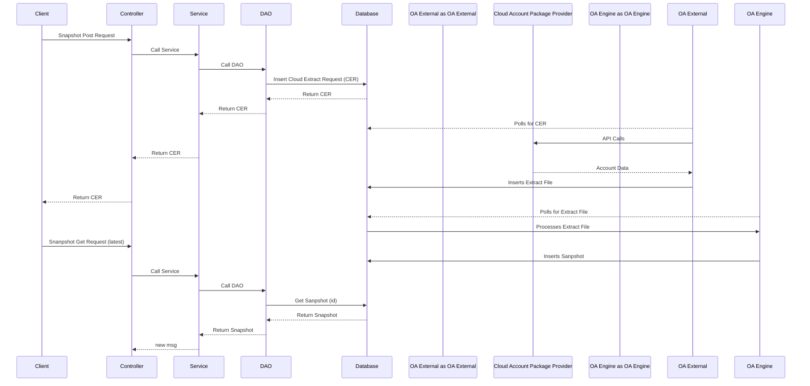

# Spring Boot AI Assistant

A modern AI application built with Spring Boot that leverages AWS Bedrock for generative AI capabilities and PostgreSQL with pgvector for efficient vector storage and similarity search.

## 🚀 Technologies

- **Java 21** - Latest LTS version with enhanced features
- **Spring Boot** - For rapid application development and microservices
- **AWS Bedrock** - Managed service for foundation models
- **PostgreSQL with pgvector** - For vector embeddings storage and similarity search
- **Maven** - Dependency management and build automation

## 📋 Prerequisites

- Java 21 JDK
- Maven 3.8+
- PostgreSQL 15+ with pgvector extension installed
- AWS Account with Bedrock access
- AWS CLI configured with appropriate permissions

## 🔧 Setup & Installation

### 1. Clone the repository

```bash
git clone https://github.com/yourusername/spring-boot-ai-assistant.git
cd spring-boot-ai-assistant
```

### 2. Configure PostgreSQL with pgvector

```bash
# Install pgvector extension (if not already installed)
CREATE EXTENSION IF NOT EXISTS vector;

# Create a database for the application
CREATE DATABASE ai_assistant;
```

### 3. Configure AWS credentials

Ensure your AWS credentials are properly configured with access to Bedrock:

```bash
# Configure AWS CLI
aws configure
```

### 4. Configure application properties

Edit `src/main/resources/application.properties`:

```properties
# Database Configuration
spring.datasource.url=jdbc:postgresql://localhost:5432/ai_assistant
spring.datasource.username=postgres
spring.datasource.password=yourpassword
spring.jpa.properties.hibernate.dialect=org.hibernate.dialect.PostgreSQLDialect
spring.jpa.hibernate.ddl-auto=update

# AWS Configuration
aws.region=us-east-1
aws.bedrock.model-id=amazon.titan-text-express-v1
aws.access-key=your-access-key
aws.secret-key=your-secret-key

# Vector Configuration
vector.dimension=1536
```

### 5. Build and run the application

```bash
mvn clean install
mvn spring-boot:run
```

## 🏗️ Project Structure

```
.
├── src/
│   ├── main/
│   │   ├── java/
│   │   │   └── com/example/ai/
│   │   │       ├── config/
│   │   │       │   ├── AwsConfig.java
│   │   │       │   └── VectorConfig.java
│   │   │       ├── controller/
│   │   │       │   └── AiController.java
│   │   │       ├── model/
│   │   │       │   ├── Embedding.java
│   │   │       │   └── AiRequest.java
│   │   │       ├── repository/
│   │   │       │   └── EmbeddingRepository.java
│   │   │       ├── service/
│   │   │       │   ├── AiService.java
│   │   │       │   ├── BedrockService.java
│   │   │       │   └── VectorService.java
│   │   │       └── Application.java
│   │   └── resources/
│   │       ├── application.properties
│   │       └── static/
│   └── test/
│       └── java/
│           └── com/example/ai/
│               └── service/
│                   ├── AiServiceTest.java
│                   └── VectorServiceTest.java
├── pom.xml
└── README.md
```

## 🌟 Key Features

- Text generation using AWS Bedrock models
- Efficient vector storage and retrieval with pgvector
- RESTful API for AI interactions
- Semantic search capabilities
- Customizable model parameters

## 🔍 API Endpoints

### Generate AI Response

```
POST /api/v1/ai/generate
Content-Type: application/json

{
  "prompt": "Your input text here",
  "temperature": 0.7,
  "maxTokens": 512
}
```

### Search Similar Content

```
POST /api/v1/ai/search
Content-Type: application/json

{
  "query": "Your search query",
  "limit": 5
}
```

## 📚 Maven Dependencies

The project includes these key dependencies:

```xml
<!-- Spring Boot Starter -->
<dependency>
    <groupId>org.springframework.boot</groupId>
    <artifactId>spring-boot-starter-web</artifactId>
</dependency>

<!-- Spring Data JPA -->
<dependency>
    <groupId>org.springframework.boot</groupId>
    <artifactId>spring-boot-starter-data-jpa</artifactId>
</dependency>

<!-- PostgreSQL Driver -->
<dependency>
    <groupId>org.postgresql</groupId>
    <artifactId>postgresql</artifactId>
</dependency>

<!-- AWS Java SDK for Bedrock -->
<dependency>
    <groupId>software.amazon.awssdk</groupId>
    <artifactId>bedrock-runtime</artifactId>
    <version>2.20.0</version>
</dependency>

<!-- Other dependencies -->
```

## 🧪 Testing

Run tests using Maven:

```bash
mvn test
```

## 🔒 Security Considerations

- Store AWS credentials securely using environment variables or AWS secrets manager
- Implement proper authentication and authorization for API endpoints
- Sanitize and validate all user inputs
- Consider rate limiting for API requests

## 📈 Performance Optimization

- Enable PostgreSQL connection pooling
- Configure appropriate JVM settings for memory usage
- Consider caching for frequently requested embeddings
- Implement batch processing for large datasets

## 🤝 Contributing

1. Fork the repository
2. Create your feature branch (`git checkout -b feature/amazing-feature`)
3. Commit your changes (`git commit -m 'Add some amazing feature'`)
4. Push to the branch (`git push origin feature/amazing-feature`)
5. Open a Pull Request

## 📄 License

This project is licensed under the MIT License - see the LICENSE file for details.

## 👥 Authors

- **Your Name** - *Initial work*

## 🙏 Acknowledgments

- AWS Bedrock team for providing the foundation models
- pgvector creators for the PostgreSQL vector extension

# Snapshot Flow


